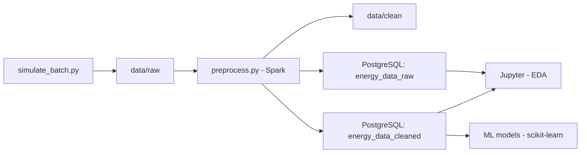

# ⚡ Batch Energy Monitoring

Simulación y procesamiento batch de consumo energético residencial usando PySpark, PostgreSQL, y herramientas modernas de Data Engineering.


---

## 📌 Descripción

Este proyecto simula el consumo energético de distintas viviendas en un vecindario y ejecuta un pipeline batch completo:

- Simulación de datos sintéticos y realistas
- Limpieza y validación de datos en Spark
- Ingesta a PostgreSQL mediante Spark Structured Streaming
- Análisis exploratorio con Jupyter y modelado con scikit-learn
- Contenerización completa usando Docker

---

## 🏗️ Arquitectura



---

## 🔧 Herramientas utilizadas

| Herramienta     | Propósito                          |
|------------------|-----------------------------------|
| 🐍 Python         | Scripts y procesamiento            |
| 🔥 PySpark        | Limpieza batch con Spark          |
| 🐘 PostgreSQL     | Almacenamiento estructurado       |
| 📦 SQLAlchemy     | Conexión ORM a la base de datos   |
| 📓 Jupyter        | Análisis exploratorio (EDA)       |
| 🧪 Scikit-learn   | Modelado predictivo               |
| 🐳 Docker         | Contenedores reproducibles        |

---

## 🏠 Simulación inteligente

- Cada casa tiene un perfil: **bajo**, **medio** o **alto** consumo
- Se simulan **estacionalidades climáticas** (verano/invierno)
- Se introducen **picos realistas** y registros erróneos para control de calidad
- Se avanza en tiempo simulado (`simulated_timestamp`) con granularidad configurable (1, 15, 30 minutos...)

---

## 📈 ¿Qué permite analizar?

- Distribución y variabilidad del consumo por vivienda y por día
- Relación entre consumo, temperatura y voltaje
- Casos anómalos o errores en sensores
- Clasificación automática de viviendas con ML (futuro)

---

## 🚀 Cómo ejecutar

1. Clona el repositorio:

```bash
git clone https://github.com/TomasFuentesA/batch-energy-monitoring.git
cd batch-energy-monitoring
```

2. Levanta todos los servicios con Docker:

```bash
docker-compose up --build
```

3. Ingresa a Jupyter Notebook para análisis exploratorio (ver instrucciones en la carpeta `notebooks/`)

---

## 📂 Estructura del proyecto

```
batch-energy-monitoring/
│
├── data/               # Archivos raw y clean (por lote)
├── db/                 # Dockerfile y init.sql para PostgreSQL
├── spark_jobs/         # Scripts en PySpark
├── notebooks/          # EDA y visualizaciones
├── dashboards/         # (Opcional) para futuras visualizaciones
├── Dockerfile          # Imagen para Spark y Python
├── docker-compose.yml  # Orquestación de contenedores
└── requirements.txt    # Dependencias del proyecto
```

---

## 🌟 Habilidades desarrolladas

- Diseño de pipelines de datos batch
- Simulación sintética basada en perfiles
- Limpieza y validación con PySpark
- Arquitectura distribuida y contenedores
- Ingesta y modelado SQL con SQLAlchemy
- Análisis exploratorio con Jupyter
- ML aplicado a series temporales (en desarrollo)

---

## 🧠 Futuro

- Clasificación automática de casas según consumo
- Detección de anomalías energéticas
- Visualización interactiva con Streamlit (posible extensión)

---

## 📬 Contacto

👤 Desarrollado por [Tomas Fuentes](https://github.com/TomasFuentesA)  
📧 tomas.fuentesa@gmail.com

---

> Este proyecto es una plataforma de aprendizaje aplicada que combina ingeniería de datos, simulación realista y análisis predictivo. Ideal para portafolios o pruebas de concepto empresariales.
