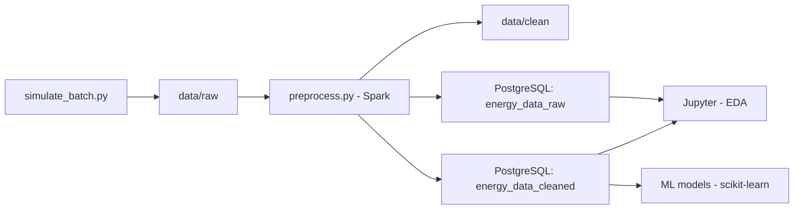

# ⚡ Batch Energy Monitoring — Proyecto de Data Science End-to-End

Simulación, procesamiento y análisis exploratorio de consumo energético residencial utilizando un enfoque realista de Data Science, desde los datos crudos hasta la preparación para Machine Learning.


---

## 📌 Descripción

Este proyecto de ciencia de datos simula el consumo energético de un vecindario y recorre todo el ciclo de vida de un proyecto de DS:

- 🏠 Simulación realista de datos sintéticos con patrones estacionales y errores reales
- 🧹 Limpieza y transformación a escala con PySpark
- 🧾 Ingesta estructurada en PostgreSQL
- 📊 Análisis exploratorio profundo en Jupyter
- 🤖 Base lista para modelado predictivo con scikit-learn
- 🐳 Infraestructura portable con Docker

---

## 🏗️ Arquitectura del flujo de datos



---

## 🧰 Herramientas utilizadas

| Herramienta     | Rol en el proyecto                   |
|-----------------|--------------------------------------|
| 🐍 Python        | Lógica general y scripts             |
| 🔥 PySpark       | Limpieza batch y transformación      |
| 🐘 PostgreSQL    | Base de datos estructurada           |
| 📦 SQLAlchemy    | Inserciones desde Python             |
| 📓 Jupyter       | EDA y visualización exploratoria     |
| 🧪 Scikit-learn  | Preparación y modelado predictivo    |
| 🐳 Docker        | Infraestructura reproducible         |

---

## 🏠 Lógica de simulación

- Casas con perfiles de consumo: **bajo**, **medio** y **alto**
- Variación según estación del año (invierno/verano)
- Relación directa entre temperatura, consumo y voltaje
- Presencia de outliers **realistas** y **errores sintéticos** para pruebas de robustez
- Tiempos simulados desde `2024-01-01` con granularidad configurable (ej. 15 min)

---

## 📈 Análisis y objetivos

- Evaluar patrones de consumo diarios y por perfil
- Detectar errores, valores atípicos y variabilidad natural
- Visualizar la correlación entre temperatura y consumo
- Preparar dataset para:
  - Clasificación de viviendas
  - Detección de anomalías
  - Predicción de consumo energético

---

## 🚀 Cómo ejecutar

```bash
git clone https://github.com/TomasFuentesA/batch-energy-monitoring.git
cd batch-energy-monitoring
docker-compose up --build
```

Luego abre el contenedor de Jupyter para análisis (`/notebooks`).

---

## 📂 Estructura del proyecto

```
batch-energy-monitoring/
├── data/               # Datos simulados y limpios
├── db/                 # PostgreSQL y scripts de init
├── spark_jobs/         # Preprocesamiento con Spark
├── notebooks/          # Análisis exploratorio
├── Dockerfile          # Imagen principal
├── docker-compose.yml  # Orquestación de servicios
└── requirements.txt    # Dependencias del entorno
```

---

## 🌟 Habilidades desarrolladas

- Generación y manipulación de datos sintéticos
- ETL batch con PySpark
- Diseño y uso de esquemas SQL para analítica
- Control de errores reales en flujos de datos
- Visualización de datos multivariados
- Modelado supervisado en scikit-learn

---

## 🔮 Futuro

- Clasificación automática de viviendas
- Modelos de predicción por perfil y estacionalidad
- Detección temprana de errores de medición

---

## 📬 Contacto

👤 Desarrollado por [Tomas Fuentes](https://github.com/TomasFuentesA)  
📧 fuentesarayat@gmail.com

---

> Proyecto completo de Data Science aplicado al mundo real: desde la simulación hasta el análisis y modelado predictivo.
